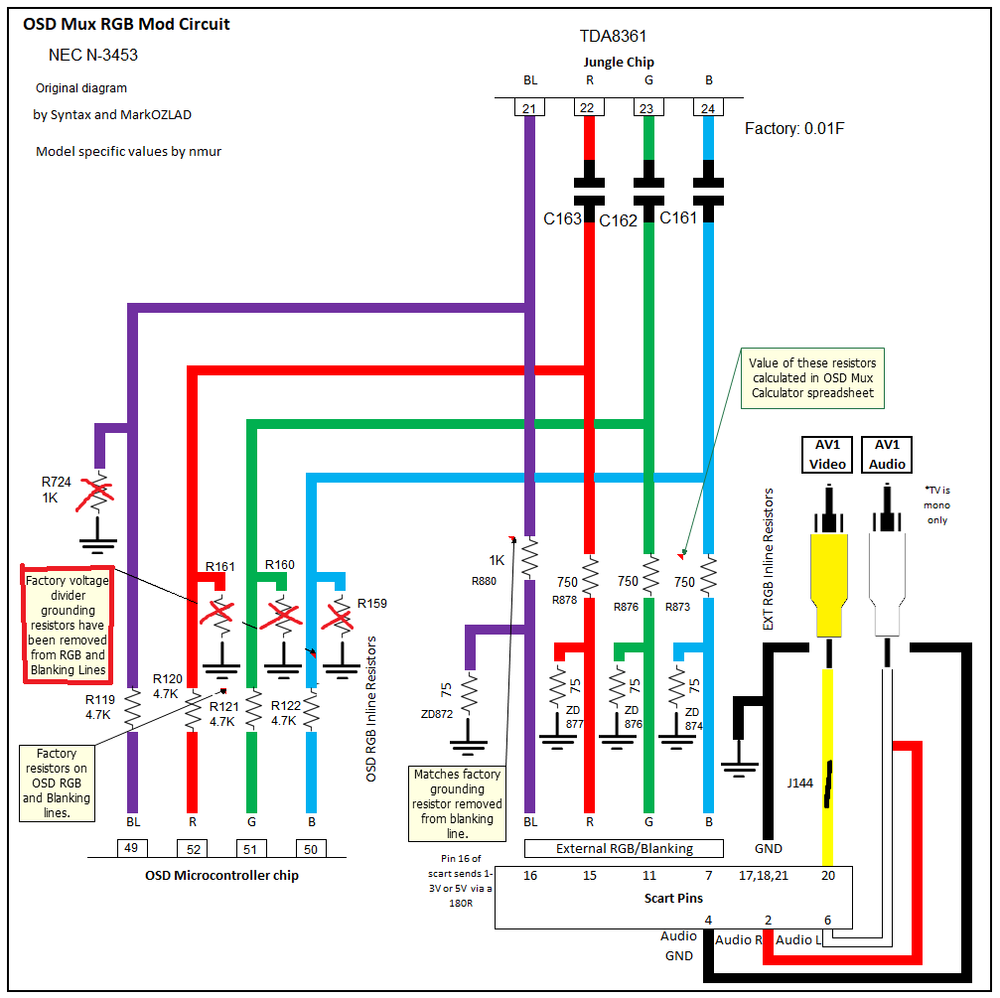

# NEC N-3453 RGB MUX Mod

This set has an unpopulated SCART input which we can use to mount a PCB mounted SCART socket, as well as leverage portions of the unused circuit for our required components.  

## Infomation and Resources

Jungle: TDA8361
Chassis: NEC MM-1

[Service Manual (Not an exact match)](./res/service_manual.jpg)

## Schematic

## Component Values

| Part #       | Component    | Value      |
| ------------ | ------------ | ---------- |
| M805         | SCART Socket |            |
| J144         | Jump         |            |
| ZD872        | Resistor     | 75 Ohm     |
| ZD874        | Resistor     | 75 Ohm     |
| ZD876        | Resistor     | 75 Ohm     |
| ZD877        | Resistor     | 75 Ohm     |
| R873         | Resistor     | 750 Ohm    |
| R876         | Resistor     | 750 Ohm    |
| R878         | Resistor     | 750 Ohm    |
| R880         | Resistor     | 1K Ohm     |
| R724         | Resistor     | Remove     |
| R159         | Resistor     | Remove     |
| R160         | Resistor     | Remove     |
| R161         | Resistor     | Remove     |

### Additional Steps  

Install jumper wires from R873/R876/R878/R880 to R122/R121/R120/R119, using the vacant adjacent component through holes. 

[Photo reference](./img/wiring.jpg)
